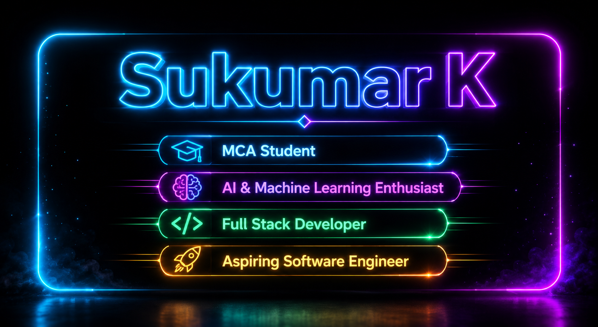

  

# Hi 👋 I'm Sukumar

🎓 MCA Student  
💻 Full Stack Developer  
🧪 Software Testing & QA Enthusiast  
🚀 Aspiring Software Engineer  

---

## 👨‍💻 About Me

- MCA Student at New Horizon College of Engineering, Bengaluru
- Building full-stack web applications using Java, Python, PHP, JavaScript, and MySQL
- Hands-on experience in website testing and quality assurance
- Interested in software development, web technologies, and testing
- Currently strengthening Data Structures, Object-Oriented Programming, DBMS, Operating Systems, and Computer Networks

---

## 🎓 Education

### Master of Computer Applications (2025–2027)

**New Horizon College of Engineering, Bengaluru**

CGPA: **8.34** (Pursuing)

### Bachelor of Computer Applications (2022–2025)

**Sahyadri Degree College, Kolar**

CGPA: **9.1**

---

## 🛠️ Technical Skills

  

### Programming

Java • Python • C • SQL

### Web Technologies

HTML • CSS • JavaScript • PHP

### Backend

Java Servlets • JDBC • LAMP Stack

### Database

MySQL

### Core Computer Science

Data Structures • Object-Oriented Programming • DBMS • Operating Systems • Computer Networks

### Testing

Functional Testing • UI/UX Testing • Usability Testing • Bug Reporting

### Tools

Git • GitHub • Eclipse • Apache Tomcat • MySQL Workbench • Power BI • Excel

---

## 💼 Practical Experience

### 🧪 Website Testing & Quality Assurance

**Ziko Home Realty Pvt. Ltd. — May 2026**

- Performed functional, UI/UX, and usability testing of a real-estate platform during its pre-launch phase.
- Identified and reported bugs and technical issues and validated website features.
- Provided feedback on usability, functionality, performance, and platform quality.

### 💻 LAMP Stack Internship

**Hysteresis Pvt. Ltd. — Jan 2025 – Mar 2025**

- Completed hands-on training in LAMP stack development using Linux, Apache, MySQL, and PHP.
- Built and tested PHP/MySQL-based web functionality.
- Applied PHP and MySQL skills directly in the Live Cricket Auction System project.

---

## 🚀 Featured Projects

### 🌱 Smart Agriculture Platform

**Tech Stack:** Java Servlets, JSP, JDBC, MySQL, HTML, CSS, JavaScript, Apache Tomcat

A full-stack smart agriculture platform developed as an MCA Semester II mini project.

#### Features

- Real-time weather insights using Weather API
- Geolocation-based weather information
- Rule-based crop recommendations
- Profitability scoring
- User authentication
- Weather and crop data management
- Yield prediction module
- MySQL database integration
- DFD and ER diagram-based system design

---

### 🏏 Live Cricket Auction System

**Tech Stack:** HTML, CSS, JavaScript, PHP, MySQL

A real-time cricket auction platform developed for managing player auctions and live bidding.

#### Features

- Real-time player bidding
- Team management
- Player management
- Auction workflow management
- Responsive user interface
- Front-end and back-end integration
- Online deployment

🌐 **Live Demo:**  
https://ycc-tournament-sukumar-k.kesug.com/

---

### 👕 AI-Powered Clothes Recommendation & Shopping System

**Tech Stack:** Python, HTML, CSS, JavaScript

An AI-based clothing recommendation system that suggests clothing based on user preferences with an integrated shopping cart and web interface.

#### Features

- Personalized clothing recommendations
- User preference-based suggestions
- Shopping cart functionality
- Product management
- Interactive web interface

🌐 **Project Repository:**  
https://sukumar-k-mca.github.io/FitFusionAI/

---

## 📜 Certifications

- **LAMP Stack Internship Certification** — Hysteresis Pvt. Ltd. (PHP & MySQL)
- **Introduction to Modern AI** — Cisco Networking Academy
- **Networking Devices and Initial Configuration** — Cisco Networking Academy
- **Entrepreneurship Essentials** — NPTEL SWAYAM
- **Python Programming From Scratch** — Dhaaps

---

## 📊 GitHub

  

---

## 🌐 Connect With Me

---

  💡 Building Web Applications | Learning & Growing | Aspiring Software Engineer

  ⭐ Always learning. Always building.

